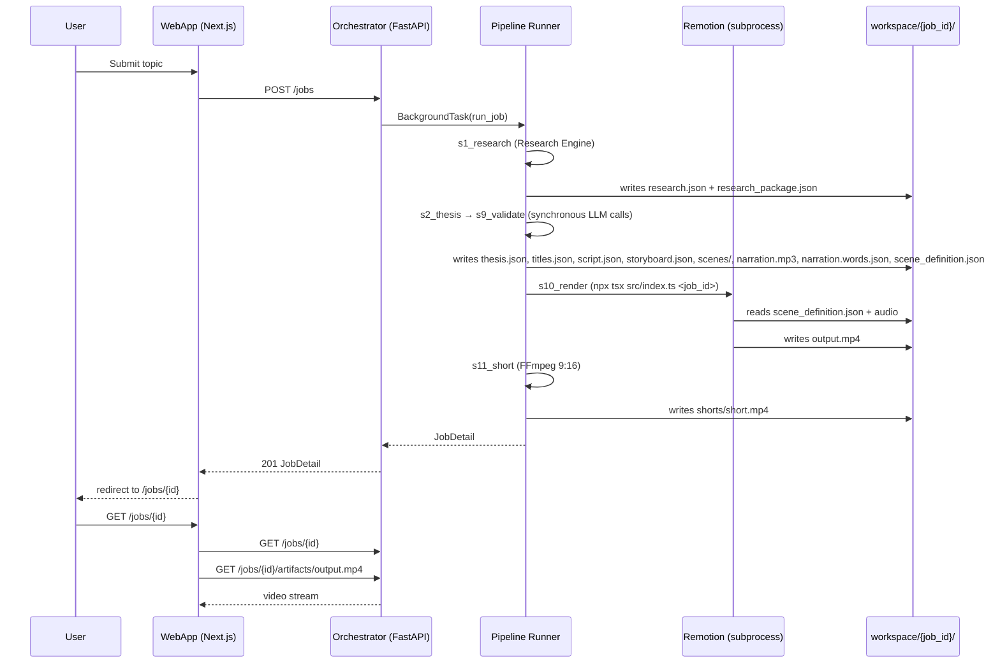
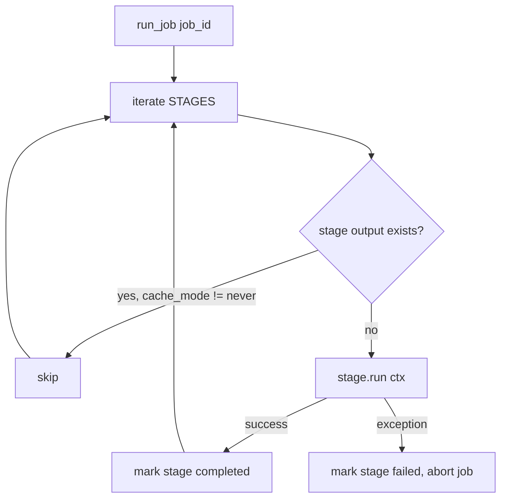
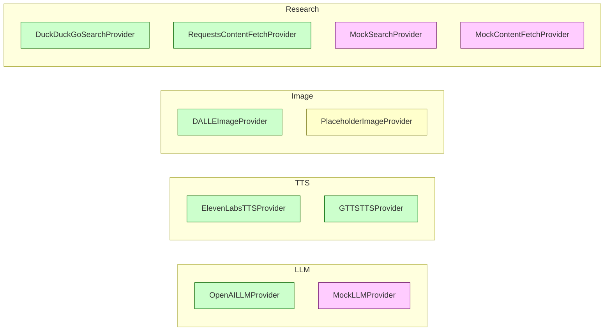

# ARCHITECTURE

The actual architecture, reconstructed from code (not documentation). All
claims cite `file:line` so any future AI can re-verify.

## High-level System

```mermaid
flowchart LR
    User --> WebApp
    WebApp -->|HTTP JSON| Orchestrator
    Orchestrator -->|sequential stages| Workspace[("workspace/{job_id}/")]
    Orchestrator -->|subprocess: npx tsx| Renderer
    Renderer -->|MP4| Workspace
    Workspace -->|served via /jobs/{id}/artifacts/*| WebApp
```

## Process Topology

Three long-lived processes on the dev host, launched by `start.bat`:

1. **webapp** — `cd webapp && npm run dev` — Next.js 14 dev server, port 3000.
   File: `start.bat`.
2. **orchestrator** — `cd orchestrator && python -m app.main` — FastAPI +
   uvicorn, port 8000. Entry point: `orchestrator/app/main.py`.
3. **renderer** — **not a long-lived process.** Invoked synchronously by the
   orchestrator as a subprocess per job:
   `npx tsx src/index.ts <job_id>`. See
   `orchestrator/app/pipeline/stages/s10_render.py:49`.

## Request Flow



## Pipeline Runner

Source: `orchestrator/app/pipeline/runner.py:83`.



`STAGES` order (`runner.py`):

```python
STAGES = [
    ResearchStage(),     # s1
    ThesisStage(),       # s2
    TitlesStage(),       # s3
    ScriptStage(),       # s4
    StoryboardStage(),   # s5
    AssetsStage(),       # s6
    NarrationStage(),    # s7
    SceneJsonStage(),    # s8
    ValidateStage(),     # s9
    RenderStage(),       # s10
    ShortsStage(),       # s11
]
```

## Persistence

Active store: **file-based JSON**.
Implementation: `orchestrator/app/db/store.py:130`. Each job is a JSON file
under `workspace/{job_id}/job.json`. The same directory also holds all
stage outputs.

For PROMPT 12, render jobs use a dedicated `render_job.json` at
`workspace/{job_id}/render_job.json`, managed by `RenderOrchestrator`.

Configured-but-unused: `docker-compose.yml` declares `redis` and
`postgres:16` services. The orchestrator code never imports a DB driver or
SQLAlchemy. See `docs/TECHNICAL_DEBT.md` C-006.

## Provider System



Factory functions (`orchestrator/app/providers/llm.py`,
`tts.py`, `image.py`, `research_providers.py`) read settings and return the
real or mock implementation based on env / flag presence. See
`docs/PROVIDER_REGISTRY.md`.

## Renderer Boundary

`SceneDefinition` is the **single contract** between orchestrator and
renderer:

```
orchestrator ──scene_definition.json──> renderer (Remotion)
renderer    ──output.mp4──────────────> workspace/{job_id}/
```

Producer: `orchestrator/app/pipeline/stages/s8_scene_json.py`.
Validator: `orchestrator/app/pipeline/stages/s9_validate.py`.
Consumer: `renderer/src/index.ts` (CLI) → `renderer/src/lib/loadScene.ts`
→ `renderer/src/compositions/Documentary.tsx`.

The Python schema lives at `orchestrator/app/schemas/scene_definition.py`
(288 lines). The TypeScript mirror at `renderer/src/scenes/types.ts` is
hand-written. There are **no automated tests** verifying the two stay in
sync. Several Python fields have no TS consumer; see
`docs/TECHNICAL_DEBT.md` C-004/C-005.

## Cache

Two distinct cache layers:

1. **Stage skip-cache** — `orchestrator/app/pipeline/cache.py:26`. Skips a
   stage if its output file already exists and `cache_mode != 'never'`.
2. **Research Engine cache** —
   `orchestrator/app/research/cache.py:111`. Content-addressed by SHA-256
   (16-char prefix) under `workspace/{job_id}/research_cache/`. TTL driven
   by `settings.research_cache_ttl_days` (default 7 days).

## Logging

- **App logger** — `orchestrator/app/core/logging.py:50`. Single stdout
  handler, JSON-friendly `extra` fields, suppresses library noise.
- **Research logger** — `orchestrator/app/research/logging.py:174`. JSON
  event log to `workspace/{job_id}/research.log` plus stdout, with named
  helpers per pipeline step.

## Known Architectural Risks

1. Single-process synchronous pipeline — long-running jobs block the
   FastAPI thread. (No Celery / Redis worker.)
2. Local filesystem as the only persistence — not concurrent-safe across
   multiple uvicorn workers. (L-036: single-instance file-based job persistence.)
3. No git history — no `.git/` directory; no diff-based memory of changes.
4. No automated contract tests between Python `SceneDefinition` and TS
   `SceneDefinition` mirror.

## Render Orchestration Architecture (PROMPT 12)

```
                    Next.js
                       |
                       ▼
                 FastAPI Render API  (/render/*)
                       |
            ┌──────────┴──────────┐
            ▼                     ▼
       Preflight              Job State  (render_job.json)
            │
            ▼
        RenderStage
            │
            ▼
        RenderPlan
            │
            ▼
         Remotion  (subprocess)
            │
            ▼
     RawRenderArtifact
            │
            ▼
     MasteringPipeline  (P11)
     ├── mix_audio()
     ├── master_audio()
     ├── mux()
     ├── run_qa()
     └── finalize()
            │
            ▼
      MediaQAReport
            │
            ▼
      Atomic Finalize
            │
            ▼
    FinalVideoArtifact
            │
       ┌────┴─────┐
       ▼          ▼
    Inspector   Video API  (/render/{id}/video)
       │          │
       ▼          ▼
    React UI    HTML5 <video>
```

**Single canonical rendering path.** The orchestrator calls the existing
P11 `MasteringPipeline`. The web UI never invokes FFmpeg directly.
The API never bypasses `RenderPlan` or manually constructs
`FinalVideoArtifact`.

See `docs/PROMPT 12 — FINAL REPORT.md` for the full implementation
report.

See `docs/TECHNICAL_DEBT.md` for the full list.
