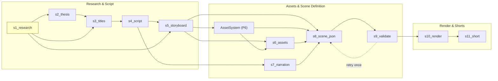
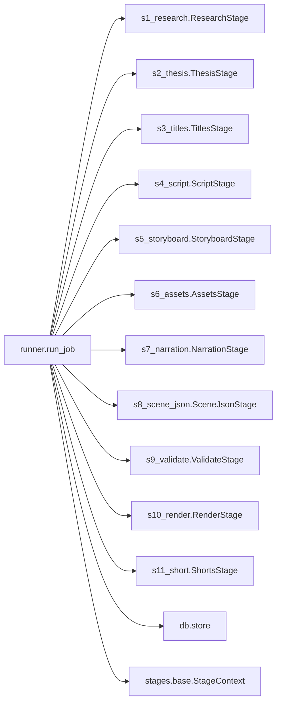
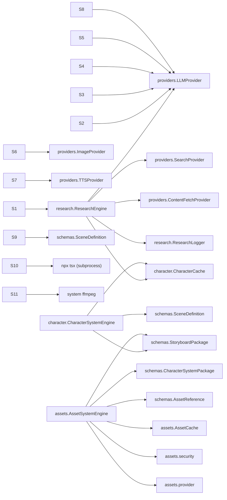
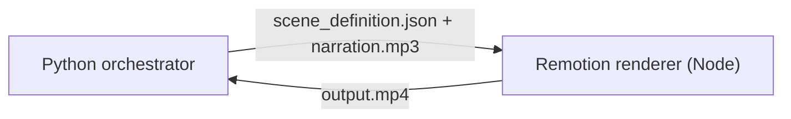

# DEPENDENCY_GRAPH

Cross-system dependencies. Edges represent "X produces artifact consumed
by Y". Only include edges actually present in code.

## Stage-to-Stage Artifact Flow

## Data Contract Flow

```mermaid
flowchart LR
    JobDetail["JobDetail (job.json)"] --> s1
    ResearchPkg["ResearchPackage (research_package.json)"]
    ResearchPkg -.to_legacy_dict.-> Legacy["ResearchPackage legacy (research.json)"]
    Legacy --> s2
    s2 --> Thesis["Thesis (thesis.json)"]
    Thesis --> s3
    s3 --> TitlePkg["TitlePackage (titles.json)"]
    TitlePkg --> s4
    Thesis --> s4
    s4 --> Script["Script (script.json)"]
    Script --> s5
    Script --> s7
    Thesis --> s5
    ResearchPkg --> s5
    s5 --> Storyboard["Storyboard (storyboard.json)"]
    s5 --> SBpkg["StoryboardPackage (storyboard_package.json)"]
    Storyboard --> s6
    Storyboard --> s8
    Script --> s8
    s7 --> Words["WordTimestamps (narration.words.json)"]
    Words --> s8
    SBpkg --> AssetEngine["AssetSystem (P6)"]
    AssetEngine --> AssetPkg["AssetSystemPackage (asset_system_package.json)"]
    AssetPkg -.prepend canonical IDs.-> s8
    AssetPkg -.additive.-> s6
    s8 --> SceneDef["SceneDefinition (scene_definition.json)"]
    SceneDef --> s9
    s9 --> s10
    s10 --> MP4["output.mp4"]
    MP4 --> s11
    s11 --> Short["shorts/short.mp4"]
```

## Module-level Imports

Source: `orchestrator/app/pipeline/runner.py`.

## Provider Dependencies

## Cross-Runtime Boundary

This is the **single cross-runtime contract** in the system. Any change to
`SceneDefinition` is a breaking change unless coordinated with the TS
mirror (`renderer/src/scenes/types.ts`).

## Cycle Detection

No import cycles detected in the orchestrator. The pipeline is a strict
DAG by construction (runner iterates `STAGES` linearly).

## Reverse-Dependencies (consumers)

| contract | produced by | consumed by |
|---|---|---|
| `research.json` (legacy) | s1 | s2, s3, s4, s5 |
| `research_package.json` (canonical) | s1 | `/research/*` API only (downstream stages do not yet consume it) |
| `thesis.json` | s2 | s3, s4 |
| `titles.json` | s3 | s4, webapp |
| `script.json` | s4 | s5, s7, s8 |
| `storyboard.json` | s5 | s6, s8 |
| `storyboard_package.json` | s5 | Character System (PROMPT 5), `/storyboard/*` API |
| `character_system_package.json` | CharacterSystemEngine | `/api/characters/*` API, future: s8 bridge |
| `narration.mp3` | s7 | s10, webapp |
| `narration.words.json` | s7 | s8 (word-by-word captions) |
| `scene_definition.json` | s8, s9 | s10 |
| `output.mp4` | s10 | s11, webapp |
| `shorts/short.mp4` | s11 | webapp |
